The LTL Checker Plugins: a (Reference) Manual
=============================================

**Huub de Beer**

*December 2004*

Introduction
------------

This document is both a user manual for the LTL Checker plugins of the ProM framework and a reference manual for the LTL Language. If you are only interested in how to use the plugins, just read Chapter [plugingui].

In that chapter, you will read about how to import your own LTL Template files via the LTL Template Import plugin. Hereafter the most attention is on how to start and use the Default LTL Checker plugin and the ’normal’ LTL Checker plugin. At the end of the chapter, you will see that results obtained from using the LTL Checker plugins can be used again in the ProM framework as you can use every log.

On the other hand, if you are interested in how to specify your own LTL properties, you will have to read chapter [language] too. That chapter explores all the details of the LTL Language, from defining attributes to creating complex LTL expressions. This chapter uses a simple running example to explain all the language elements. This example is as LTL Template file and test log file added to this manual, running.ltl and running.xml.

The last chapter contains the grammar of the LTL Language. It can be used as a short summary of the chapter about the LTL Language, without any explanation the structure of the language is presented.

How to use the LTL Checker Plugins
----------------------------------

### Introduction

This chapter is about how to use the LTL Checker plugins. There are three different plugins which are all grouped under the name “LTL Checker plugins”. These plugins are an LTL Template Import plugin, a Default LTL Checker plugin and the “normal” LTL Checker plugin.

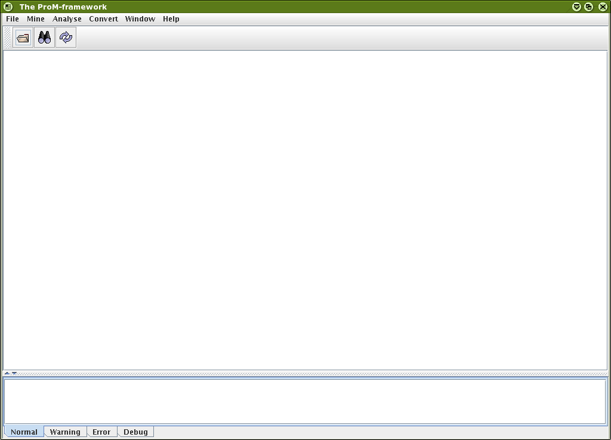

The LTL Template Import plugin is a plugin to import LTL Template files. LTL Template files are files containing the specification of properties written in the special LTL Language ( Chapter [language] ). After importing such files, the properties specified in it can be used to check workflow logs of processes: which instances of the processes have the property?

The actual check is performed by one of the LTL Checker plugins. The Default LTL Checker plugin uses a standard LTL Template file with some common ltl properties defined in it. By the “normal” LTL Checker plugin there is no standard LTL Template file, you can choose which LTL Template file you want to use, just import that one.

Both the Default and the “normal” LTL Checker plugins are analysis plugins. These analysis plugins can be used on all mined logs given an appropriate input. This means that if you will use the LTL Checker plugin, you should first mine a log. Fortunately there is an *empty mining* plugin in the framework, using that “mining algorithm” mining is reduced to just reading the log.

In the next sections of this chapter, all steps taken and windows encountered while using one of the LTL Checker plugins are explained in full detail. The first plugin to be explained is the LTL Template Import plugin.

### Importing LTL Template Files

The window of the ProM framework will look like the window displayed in Figure [plugingui:start]. In this figure the window of ProM is displayed directly after starting ProM. While using ProM, thus after mining, importing and analyzing, this window may be filled with many internal windows. Because the goal of this chapter is to teach you how to use the LTL Checker plugins, it is assumed that you start ProM from scratch, just to keep things simple.

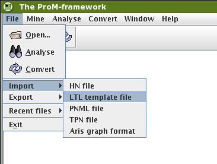

For importing an LTL Template File, you go to the -menu, and then to the sub menu . In this menu you can choose one of the items listed ( Figure [plugingui:importmenu] ), one of items is . Click on this item and a new open dialog is displayed.

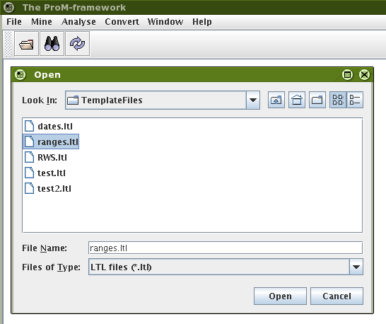

In this dialog, you navigate to the directory containing the LTL Template file you want to import, select this file, and click the button ( Figure [plugingui:opendialog] ). It is a good custom to give your LTL Template files the extension **.ltl** because you will more easily recognize your ltl-files, and in the open dialog files are initially filtered on this extension.

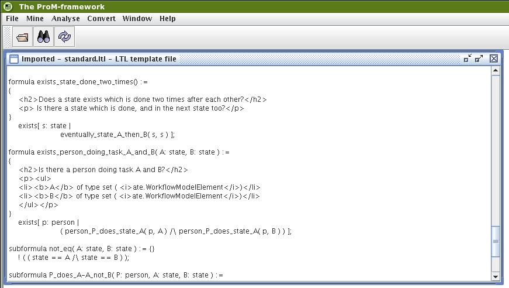

Now the framework tries to open the LTL Template file. The file is parsed by the LTL Parser and the contents of the file are putted in a *read-only* text box. This window, you see it on Figure [plugingui:openwindow], has no functionality at all, but may be, in some future it will become more elaborate.

Now the import has succeeded, as you can see in the message pane at the bottom of the ProM framework window: `Parsing complete. /home/htdebeer/TestLTL/test11.ltl imported.` Of course you will see the path and filename of your imported file, but the message is clear.

If the import does not result in success, a message is also given in the message pane: `Importing of /home/htdebeer/TestLTL/test01.ltl aborted.` In the message pane under the tab *error* can you find the error message, which gives the reason why or a hint how to solve the problem. For more information about the parse error messages, have a look in the next chapter.

### Using the stand alone LTL Parser

Happily the LTL Parser is also available as a stand alone program, so for debugging your own LTL Template files, you do not need to start ProM. The stand alone LTL Parser can be started by typing the following on the command line, assuming you are in the base directory of ProM:
 `java -classpath lib/plugins/ltlchecker.jar \hookleftarrow org.processmining.analysis.ltlchecker.parser.LTLParser \hookleftarrow file_to_parse`. When you are using the DOS operating system, you have to change the slashes into backslashes. The LTL Parser expects exactly one filename.

If the parsing is successful, no message is send to standard out, the prompt returns directly. If there is an error while parsing, a message is send to standard out, consisting of the kind of error, and on the next line the message of the error. There are three kinds of errors possible:

1.  `Error occurred during parsing:` The file is opened, but the contents are not parseble by the LTL Parser. The most likely reason is that you have made an error by writing ltl expressions.

2.  `Error while reading filename. Check the file(name) and try again.` There are problems with opening and reading the file. Maybe the file does not exist or it is already in use by another program.

3.  `Unknown error:` All errors not of kind one or two are unknown, that is, they are not expected by the parser but are thrown nonetheless. Most likely it is then a bug, so send a bug report containing the error message, and LTL Template file you try to import.

### Starting the Default LTL Checker Plugin

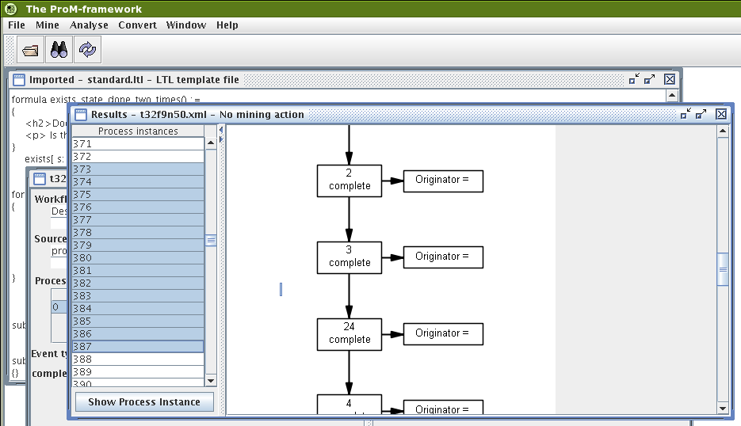

How to start the Default LTL Checker plugin is explained in this section. The Default LTL Checker Plugin can be started on *every* (mined) log, that is, the active internal window of the ProM framework window should contain such log. For now, we open just a log an mine it with the mining algorithm ( Figure [plugingui:log] ). This mining plugin does nothing but read the log and displays the contents of it in a new window. If you want, you can visualize one process instance.

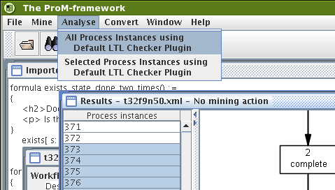

Now, with this new window ( or another log) activated so that it is the only active internal window of the ProM framework window, you can run the Default LTL Checker plugin via the menu , as is displayed in figure [plugingui:analysemenu]. After clicking one of the Default LTL Checker Plugin menu items, a new window is opened: the Template GUI ( Section [plugingui:templategui] ).

The Default LTL Checker plugin can also be started as you can the LTL Checker plugin, but that is explained later.

Internally the standard LTL Template file is parsed. This file, called `standard.ltl` and can be found in the lib/plugins subdirectory of the ProM base directory. You can change the contents of this file to your own needs. But, here again, it is a good idea to try to parse a new standard ltl file before you use it ( Section [plugingui:parser] ). If the standard file can not be opened or parsed, a message box is shown with the error message in it.

### Starting The LTL Checker Plugin

While the Default LTL Checker Plugin does not need an imported LTL Template file, the LTL Checker Plugin must have access to at least one such imported file. Here too, as was the case for the default plugin, you should have an opened ( and mined) log to use this plugin.

Once you have both, log and LTL Template file, you can start the LTL Checker Plugin by opening the window. This plugin can not be accessed through the menu because it needs two inputs: a log and an LTL Template file, it is up to you to select the appropriate input.

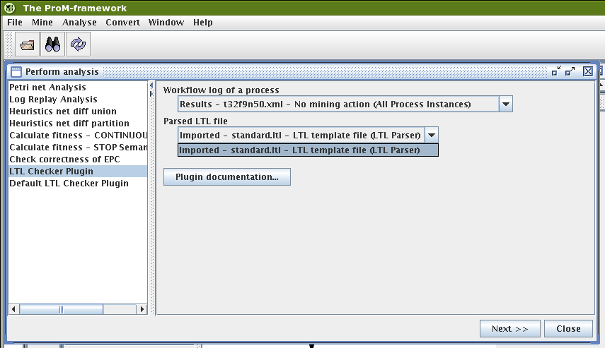

You can open the Analyze window by clicking on the *binoculars* button on the toolbar ( or press `ALT + A`). This window is displayed in Figure [plugingui:analysewindow]. As you can see, on the left hand side of the window you can select an analyze plugin. In this case you will select the LTL Checker Plugin. But as said before you can also select the Default LTL Checker plugin.

On the right hand side of the window you can select the log to check (the first combo box) and the imported LTL Template file in which the property to check can be found. Now the LTL Checker Plugin has enough information to start, so click the button and a new internal window is displayed: the Template GUI.

### Using the Template GUI

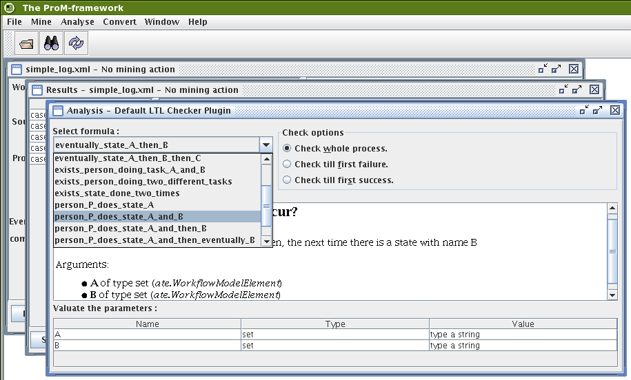

The Template GUI is a window consisting of four parts and a check button. The first part is a list of formula names from which you can choose a formula. This selected formula is used to check on the log.

Initially the first formula of the list is selected. If no formulae are defined the item *no formulae* is visible and selected. In the second part of the window, the description pane, you will see the description, if any, of the selected formula ( Figure [plugingui:chooseformula] ). If the imported LTL Template file is created with care, there should be a description for every formula. If not, just guess what the meaning is of the selected formula.

The third part of the window is the parameter table. If the selected formula has any parameters these parameters are shown in this parameter table ( Figure [plugingui:valuateparameters] ).

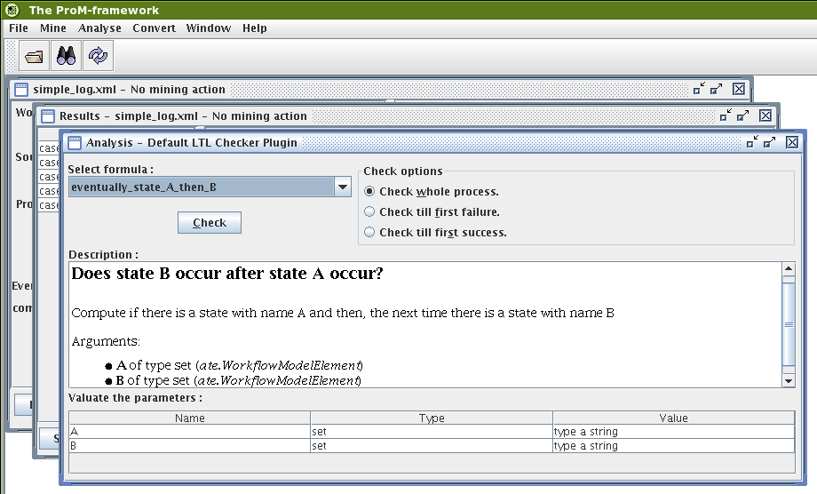

It is up to you to fill in the values you want for the different parameters. Every row of the table exists of three columns: a name, a type and a value. Initially every parameter has an initial value. For *number* attribute parameters it is *0.0*, for *date* it is the date of today formatted in the format specified by the definition of the attribute, for both *string* and *set* attribute parameters the initial value is *type a string*.

You can only fill in those values that are acceptable values for the different kinds of attribute types. This means that every value, in case its type is number or date, is parsed to a value of that type. If this parsing is successful, the new value is placed into the table, if the parsing does not succeed the old value does not change.

It is good to know that you can only fill in literals. That is, attribute names, string lists and other formulae are not accepted as values, they are interpreted as strings and, in cases of date and number attributes, they are parsed as dates or numbers respectively.

Once you have set the values you want for the parameters, you can use the next part of the Template GUI to set some check options. This part is right of the list with formulae. There are three options you can choose from:

1.  *Check whole process* Check all process instances in the log for the selected formula.

2.  *Check till first failure* Check all process instances in the log, but stop at the first encountered process instance **not having** the property specified by the selected formula.

3.  *Check till first success* The reverse of the previous item. Check all process instances in the log, but stop at the first encountered process instance **having** the property.

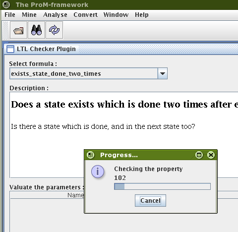

If you have set the check option you want and the parameters are valuated as you wish, you can click the button to start the actual check ( Figure [plugingui:checking] ). You will find this button below the list with formulae, so in case you select a formula without any parameters, you can then click directly the button to start checking.

By the first check, the sets for the defined set attributes are created ( these sets are reused by next checks ) and the check starts hereafter. While checking, the progress of the check is displayed together with the name of the ’current’ instance ( On the figure, the names are just numbers, but it can be every string ). If you want to stop the checking, just click the button on the progress window. After the check is done, a new window is displayed: the results window.

### Viewing the Results

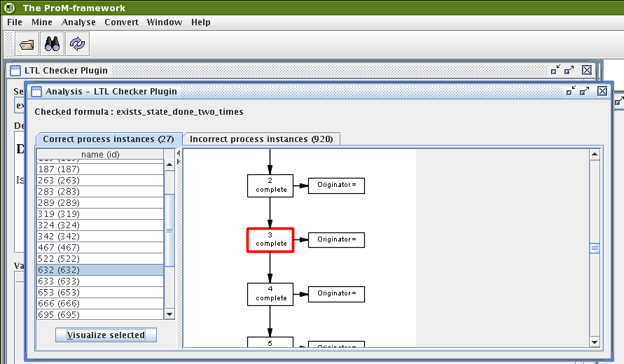

On the results window you see first the name of the checked formula. Below this text, the window is divided into two tabs: one with the correct instances and one with the incorrect instances. Both tabs have the same structure. In the title of the tab, between parentheses the number of instances on that tab is given. So you can easily see how much instances of the log are correct or incorrect ( Figure [plugingui:results]).

On the tab itself you see two parts: the actual table with the instances on the left and a visualization pane on the right. In this table, the process instances are listed, the name of the instances exists of the process instance name and between parentheses the rank of the instance in the log. Now you can easily see how the correct and incorrect instances are distributed over the log.

The visualization pane on the right hand side of the log can be used to visualize one of the instances listed in the table. Just select an instance and click the button to create a visualization of the instance.

Both the lists of correct and incorrect instances can be exported or reused as ordinary logs can be. Furthermore, a visualization can be exported too.

### Exporting the Results

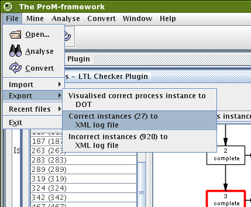

Exporting of the results, both the lists with instances and the visualizations, is very easy. As in Figure [plugingui:export] can be seen, just go to the menu, sub menu and click on the desired export. A save dialog is displayed then, in which you can give a name and a place to save the export to.

### Reusing the results

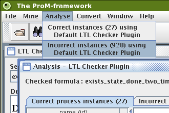

It is possible to use the results of a check again in the ProM framework, for example as input to the LTL Checker plugins. Both the Default LTL Checker plugin ( Figure [plugingui:defaultagain] ) and the “normal” LTL Checker Plugin ( Figure [plugingui:genericagain] ) can be applied on a result log, either the list with the correct instances or the list with the incorrect instances.

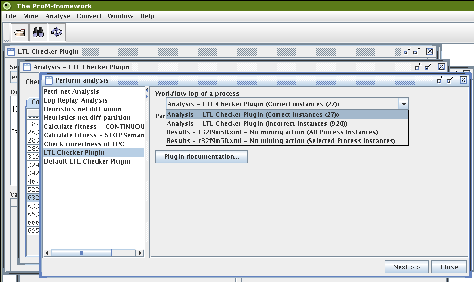

So it is possible to refine logs as far as you want, till the point you are satisfied. For example, you can filter first all instances with property P, and then on those instances check for property Q. Of course, you can create a formula R equivalent to P \(\wedge\) Q, which gives the same results, but then, you should know beforehand you want to check both P and Q. Furthermore, how smaller the log, how faster the check.

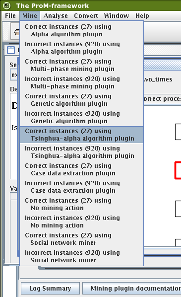

Not only the LTL Checker plugins can be used on the result logs, other plugins can be used too. For example the mining algorithms. In Figure [plugingui:mine] you see the menu containing all the possible combinations of result log and mining algorithm, just choose the desired item to start the mining.

The Language to specify LTL Properties: a reference
---------------------------------------------------

### Introduction

Using the Default LTL Checker plugin or the LTL Checker plugin with LTL Template files created by others is easy as you have read in the previous chapter. Writing your own LTL Template files is another matter. This chapter tries to give a full and complete overview of the LTL Language, so that you can specify your own LTL properties.

Before the language itself is explained, the environment the language operates in is given.

### The Environment in which the Language operates

The LTL Language specifies properties of workflow logs of processes. A process can be seen as a list of \(N\) process instances. Every process instance itself is a list of \(M\) ordered audit trail entries ( Figure [language:log]). Actual \(M\) can be different for any process instance. Both audit trail entries and process instances can have data fields. About audit trail entries we know that there are always a WorkflowModelElement and an EventType data field, other fields are permitted too.

In the language those date fields can be accessed by defining ( Subsection [language:attribute]) attributes of the appropriate type ( number, set, string or date ) for the data fields. Later these attributes can be used in logical expressions via comparisons ( Section [language:comparison]).

The value of these attributes depends on the “current” audit trail entry while checking the log. A log is checked one process instance a time. Every process instance is checked by inspecting the audit trail entries one for one from the last till the first. The current audit trail entry is that audit trail entry which is currently inspected by the checking algorithm.

The value of an attribute is computed by getting the value of the corresponding data field of the current audit trail entry. If needed, this string value is parsed to the appropriate type, thus in case the attribute is defined of type number or type date it is parsed.

In the language you can use different sorts of logical expressions. First of all, the “normal” propositional logic. This logic is about truth values only, that is, an expression is true if the operator applied on the operands results in true, otherwise it results false. The context of a propositional logic expression is determined by the temporal operators. If no temporal operators are used, a logical expression is about the first audit trail entry of a process instance only.

Another sort of logic is the quantificational logic which you can use to specify properties over all members of a set. Here again, the context of a quantificational expression is determined by temporal operators.

The last kind of logical expressions are linear temporal logic expressions. With these LTL operators you can specify properties about the current audit trail entry, the next current trail entry given the current audit trail entry, any audit trail entry given the current or all audit trail entries given the current audit trail entry. The current audit trail entry is initial the first, so by not using temporal operators, all logical expressions are about this first current initial audit trail entry.

The temporal operators are the operators which gives you the possibility to specify properties about a whole process instance, about all audit trail entries of a process instance. You can specify temporal relations between audit trail entries and so you change the context of the normal logical expressions.

#### A running Example

In this chapter a running example of a log existing of process instances of persons doing different tasks is used. Every process instance has two data fields: a name and a case number. For every audit trail entry minimal three data fields are available: WorkflowModelElement, here called *task*; Originator, here called *person* and Timestamp, here not used. Furthermore, all audit trail entries do have a EventType data field, but the value is always *complete* so this field is not mentioned any more.

Besides those standard data fields, audit trail entries can have extra data fields depending on the task. In Figure [language:pi01] you see a visualization of one of such process instances of the example log. On the figure you see the current process instance, that is the process instance for which a property is computed. The current audit trail entry is the one with the red circle ( or the grey circle) called **D**.

When new language elements are introduced they are explained by using this figure. To be complete, for this running example there are two files added to the manual: running.ltl and running.xml. The first file contains the ltl properties specified this chapter and the second file contains a log to test the properties specified in this chapter.

### Definitions and Comments

An LTL Template file can consist of four different items: comments, attribute definitions, renamings of those defined attributes and formula definitions. Those items can be mixed in any order, but a definition can only be used if it is already defined. Now the different items are described.

#### Comments

Comments are the most simple elements of the language. A comment starts with a `#` and the rest of the line after the `#`, including the `#` is skipped by the parser as comment.

It is a good practice to use comments in your LTL Template files to document your files in such a manner that you and others can understand and adapt the file later on, also after some time. It is very easy to create formulae, but to understand them can be more difficult if the formulae becomes more complex, then comments can be of great help.

##### Examples

We start our running example by creating some comment lines with some information about the file:

    #######################################
    # version  : 0.0
    # date     : 01122004
    # author   : HT de Beer
    ##

Of course comments at the start of a file only is not that useful. It is also possible to use comments in definitions of formula, after attribute definitions, the line before renamings, and so on. Later on in this chapter, you will see examples of this.

##### Parse errors

No errors specified.

#### Attribute Definitions

Definitions of an attribute are more complex than writing comments, but it is easy enough. An attribute definition starts with a keyword denoting the type of the attribute. There are four types and thus four keywords: `number`, `set`, `string` and `date`.

After the type you give the name of the attribute. This name must be unique and exists of two parts: a scope prefix and the name of the corresponding data element in the workflow log. The scope prefix is either “`ate.`” or “`pi.`” and denotes if the data element is an element of an audit trail entry (`ate.`) or if the data element is an element of a process instance (`pi`). So if a data element exists as well as a process instance element and as an audit trail entry element, you can define both as an apart attribute because the scope prefix results in two different names.

If you are not defining a date attribute, you are ready after putting a semicolon. For a date attribute you should give the `:=` keyword followed by a date pattern, and finally a semicolon too. Hereafter the different types are described:

-   `number`
     The first type of attribute you can define is the `number` attribute. A number attribute can contain values that can be parsed as integers or floating point numbers. internally both integers and floating point numbers are parsed to floating point numbers only. Examples are: `12`, `12.34`, `12.34e5`, `9E-23` and `-123444`.

    You define a number attribute for data element *data-element* as follows: `number pi.data-element;` or `number ate.data-element;`, depending on the scope of the data element.

-   `string`
     Attributes of type string are attributes which contain string values. Because in the log itself all data elements are strings, string attributes can be used for all data elements. No extra parsing is needed from the data element to an attribute. But when you want to use special properties of dates, numbers or sets, it is a good idea to define data elements of the respectively type. For the string type, a special regular expression operator is available ( Subsection [language:regexp] ).

    You define a string attribute for data element *data-element* as follows: `string pi.data-element;` or `string ate.data-element;`, depending on the scope of the data element.

-   `set`
     The set type is used for quantification, because quantification can only be used on set type attributes. For every set attribute a real set containing all the unique values of this data element of all process instances and all audit trail entries is created. An extra set operator is the `in` operator ( Subsection [language:in] ).

    You define a set attribute for data element *data-element* as follows: `set pi.data-element;` or `set ate.data-element;`, depending on the scope of the data element.

-   `date`
     The last type is the date type. It can be used to access data elements containing date strings. Because there are many forms in which a date can be described, a special string, the date pattern is added to the date type attribute definition. The date pattern is afterwards used to create a SimpleDateFormat object of the Java programming language. The format of date patterns allowed is described at http://java.sun.com/j2se/1.4.2/docs/api/java/text/SimpleDateFormat.html, a web page containing information about the SimpleDateFormat class.

    For now we give a short description on how to create a date pattern, for a full explanation, read the web page mentioned earlier. In short, a date pattern exists of characters with special meaning. If you want to put characters themselves in a data pattern, use a “’” to enclose them. Now a table with some date characters are given. This list is not complete, therefor again, have a look at the web site mentioned earlier.

    |:----|:-------------------|
    | y   | year               |
    | M   | month in year      |
    | w   | week in year       |
    | W   | week in month      |
    | D   | day in year        |
    | d   | day in month       |
    | E   | day in week        |
    | H   | hour in day (0-23) |
    | k   | hour in day (1-23) |
    | m   | minute in hour     |
    | s   | second in minute   |
    | S   | millisecond        |

    With these date characters, you now can build date patterns, like:

    -   *yyyy-MM-dd* : thus strings of the form 2006-12-09.

    -   *’date=’ddMMyy* : strings like date=230907.

    -   *HH:mm* : strings denoting time like 12:45.

    You define a date attribute for data element *data-element* and date pattern *“date-pattern”* as follows: `date pi.data-element := data-pattern;` or `date ate.data-element := date-pattern;`, depending on the scope of the data element.

An attribute can only be defined and used if there is a corresponding data element. All data elements you want to query about should be defined as an attribute, also the standard data fields like WorkflowModelElement, EventType, Timestamp and Originator. That these elements are treated separate from the other data elements in the logs, does not mean they are treated special in the LTL Checker and LTL Language. In fact, in the LTL Language all data elements, the standard ones too, are treated the same.

##### Examples

Back to our running example of figure [language:pi01]. As you can see in this figure a number of attributes are available in the log. In this example we define all the attributes: ate.WorkflowModelElement, ate.Originator, ate.dob, ate.distance, ate.question, ate.answer, pi.name and pi.case.

    #######################################
    # version  : 0.1
    # date     : 01122004
    # author   : HT de Beer
    ##

    ## 
    # Defining attributes:
    ##
    set ate.WorkflowModelElement;
    set ate.Originator;
    date ate.dob := "yyyy-MM-dd"; # Date of birth: dates have the format 'year-month-day'.
    number ate.distance;
    string ate.question;
    string ate.answer;
    string pi.name;
    number pi.case;

##### Parse errors

-   *Identifier is already defined*

    Occurs when you tries to define an attribute with the same name as another earlier defined attribute.

#### Renaming of defined Attributes

A renaming is exactly what it says: a renaming. In this case you can rename a defined attribute, which must be the name of the data element prefixed with either “pi.” or “ate.”, to a shorter, more readable or understandable alternative. In fact, you can define as many alternatives as you want, as long as every alternative has an unique name.

[language:name] Of course, as is usual in programming languages, a name can not be equal to one of the keywords. Thus `as`, `ate`, `date`, `exists`, `forall`, `formula`, `in`, `number`, `pi`, `rename`, `set`, `string`, `subformula` are not permitted as names for renamings and formulae. Furthermore, a name starts with a letter and can consists of letters, digits, -, and \_.

A renaming can be created by the keyword `rename` followed by the attribute name, the keyword `as`, the new name and finally the semicolon, as is the case for all definitions. Thus for attribute name *old-name* and new name *new-name* you write a renaming as follows: `rename old-name as new-name;`.

##### Examples

We now adapt our running example so that the defined attributes are named as in figure [language:pi01]. So ate.WorkflowModelElement is renamed as task, ate.Originator as person and ate.dob as bdate. For the other attributes we rename them to a new name without the scope prefix.

    #######################################
    # version : 0.2
    # date : 01122004
    # author : HT de Beer
    ##

    ## 
    # Defining attributes:
    ##
    set ate.WorkflowModelElement;
    set ate.Originator;
    date ate.dob := "yyyy-MM-dd"; # dates have the format 'year-month-day'.
    number ate.distance;
    string ate.question;
    string ate.answer;
    string pi.name;
    number pi.case;

    ##
    # Renamings
    ##
    rename ate.WorkflowModelElement as task;
    rename ate.Originator as person;
    rename ate.dob as bdate;
    rename ate.distance as distance;
    rename ate.question as question;
    rename ate.answer as answer;
    rename pi.name as name;
    rename pi.case as case;

##### Parse errors

-   *Identifier is already defined.*

    The new name is already in use as another renaming or formula name.

-   *Identifier is not a defined attribute.*

    You try to rename a formula or a renaming, but that is not possible. You can only rename attributes.

#### Formula Definitions

Now you can define attributes and rename them to something more writable, you can use those definitions to define formulae. There are two kinds of formulae: formulae and sub formulae. Both are defined exactly the same but the first keyword, respectively `formula` and `subformula`, is different. The distinction is that sub formulae are not visible in the Template GUI ( Section [plugingui:templategui] ), that is, they can not be called by the user of the GUI. Formulae are the visible formulae, the formulae which the user can select and check.

A formula or subformula is defined as follows: the keyword `formula` or `subformula` followed by an unique name, a list of parameters between parentheses (the list may be empty), the keyword `:=`, a description, the actual formula and finally the well known semicolon. Thus: `formula A_formula_name ( arg1: attr1, arg2: attr2 ) := { A description } actual formula doing something with the arguments ;`.

The different elements of a formula definition are now explained.

##### The list of arguments of a formula

The list of arguments is a comma separated list of so called local renamings, that is a new unique name in the local context followed by a colon and the attribute the new name is a local renaming for. The name of the local renaming can not be the same as a name of an attribute, renaming or formula, but it can be the same as an argument of another formula.

Furthermore the attribute, comparable with types in programming languages, is an already defined attribute ( or a renaming of an attribute ). Such a pair `argument_name : attribute_name` denotes that the name of the argument must be interpreted as a local renaming of the attribute. In expressions later on in the formula definition, this name can be used as such ( but only on the right hand side of an comparison, see Section [language:comparison] ).

The list, as said before, may be empty, but the parenthesis are obligatory in all cases, also if the list is empty.

##### The description of a formula

A description of a formula is the part of the formula definition in which you can inform the user of your defined formulae what the meaning and the use of the formula is. In the Template GUI ( see section [plugingui:templategui] ) the contents of the description are displayed in the description pane. Because the description pane renders its content as HTML 3.2, you can use those HTML 3.2 tags to create a more elaborate description for the user.

In fact, it is recommend to use HTML 3.2 code in your description. But only the contents of the body tag should be used because the rest of the HTML code is supplied by the plugin itself. Furthermore it is advisable to create your descriptions along the guidelines given below, just to create a consistent view for the user. On the other hand, it is all up to you to do so or not. I know programmers are lazy, so empty descriptions shall be used much. In principle, there is nothing wrong with that, as long as you are writing the formula definitions for your own. But once you write your formulae for an (unknown) audience, use the description wisely.

A description is made out of braces where in between the contents of the description are placed. The guidelines for writing a description:
 1. Start with the title, or name of the formula in between *h2* tags.

1.  Divide your description into paragraphs using the *p* tags.

2.  In the first paragraph you give a short description of the meaning of the formula in terms of the arguments.

3.  in the next paragraph, or, in case of a simple formula in the first, you list the arguments using an unordered list( using the *ul* tag. Every item in the list (create a list item with the *li* tag) starts with the name of the argument in bold (*b* tag), followed by the meaning of the argument. Give then the attribute in italics (*i* tag ) and the type of the attribute ( eventually in italics too). Then a recommendation of the value the user should give. For example a range or the pattern of the date pattern in case of a date attribute.

4.  Write now a more detailed description and or other remarks if needed.

##### The actual formula

The actual formula is given in terms of propositional logic (section [language:proposition]), quantification (section [language:quantification]), linear temporal logic ( Section [language:ltl] ), comparisons ( Section [language:comparison] ) or (sub)formula calls ( Section [language:formulacalls] ). That is, the actual formula consists of correct expressions ( in this language ) combined to bigger expressions by the operators in this language.

##### Examples

For the running example we define now one formula, in which you see all elements of a formula definition. Because till now you have not learned how to write the actual formula, a very simple formula is defined. The description as is given here is the only full description according to the guidelines you will read in this manual, because the goal is to learn to write ltl formulae, not to write good descriptions.

    #######################################
    # version : 0.3
    # ... 
    # This part of the file is as in example version 0.2
    # ...
    ##
    # Formulae
    ##
    formula eventually_task_A_is_done_by_person_P( A : task, P: person ):=
    \{
      <h2>Does eventually P task A?</h2>

        
Is there a audit trail entry in a process instance in which person P
        does task A?

        

          <ul>
            <li><b>A</b> is a task, of attribute <i>ate.WorkflowModelElement</i>.
            For this argument fill in the task you want to check for.</li>
            <li><b>P</b> is a person, of attribute <i>ate.Originator</i>. Fill in
            the person you want to know if he or she perform task A.</li>
          </ul>
        

    \}
      <>( ( task == A /\ person == P ) );

##### Parse errors

-   *Identifier already defined.*

    The name if this formula is already a defined identifier, either of an attribute, a renaming or another (sub)formula.

-   *Identifier is already defined or used.*

    The identifier used as argument name is already used as argument name or as a global identifier, that is of an attribute, a renaming or a formulae.

-   *Identifier is not a defined attribute or renaming.*

    The identifier used as ’type’ of an argument is not a defined attribute or a renaming, so it can not fulfill the role of an argument type.

### Formula calls

A defined formula can be called in the actual formula part of a definition of another formula. Important by calling a formulae is that the formula you want to call must already be defined, you apply the right number of arguments, and, of course, of the right type. That is, an argument of type A must be applied with a value of type A, either an attribute itself ( the same, modulo renaming) or a literal of the same type as the attribute.

You call a formula by entering the name followed by a parameter list surrounded by parenthesis, this list may be empty, according to the definition of the formula to call.

The value of an argument in a call is bound at that place. With this feature, you get the value of a data element of an attribute of the audit trail entry that is current at the place the argument is used. If in the formula a nexttime operator is used, the current audit trail entry becomes the next one, but the value of the argument supplied to this formula stays the of the current one.

This “early” binding can be useful when using the nexttime operator ( Subsection [language:nexttime] ), because then the current audit trail entry becomes the next one ( if there is a next one of course ). With a formula call, you can supply such nexttime operator with a value of a attribute before the then current. So you can apply recursion of a sort. But you will read more on this subject in the subsection about the nexttime operator.

##### Examples

Because our running example has only one formula defined yet, we call it here in a new defined formula.

    #######################################
    # version : 0.4
    # ... 
    # This part of the file is as in example version 0.2
    # ...
    ##
    # Formulae
    ##
    formula eventually_task_A_is_done_by_person_P( A : task, P: person ):=
    \{
      <h2>Does eventually P task A?</h2>

        
Is there a audit trail entry in a process instance in which person P
        does task A?

        

          <ul>
            <li><b>A</b> is a task, of attribute <i>ate.WorkflowModelElement</i>.
            For this argument fill in the task you want to check for.</li>
            <li><b>P</b> is a person, of attribute <i>ate.Originator</i>. Fill in
            the person you want to know if he or she perform task A.</li>
          </ul>
        

    \}
      <>( ( task == A /\ person == P ) );

    formula does_John_drive() := 
    \{ Does John drive in a process instance? \}
      eventually_task_A_is_done_by_person_P( "driving", "John" );

##### Parse errors

-   *Identifier is not a defined formula.*

    You try to use a identifier of a attribute or renaming as a formula, and of course, you can not call such a identifier as a formula.

-   *Defined number of parameters not equal the number of arguments applied here.*

    You try to call a formula with not enough parameters, or with to much parameters. Of course, this would not work, so assure that the number of used parameters equals the number of defined arguments.

-   *Identifier has not the right type.*

    You try to use a identifier of an attribute or renaming or a local one with a different type ( attribute) than defined in the formula definition. If at place x in the argument list a argument of type A is defined, use a value of type A on place x in the parameter list of the formula call.

-   *Identifier is not a local parameter in this context.*

    You try to call the formula with a identifier that is unknown in the local context, so it is not known as a defined attribute or renaming, and not as a argument to the formula in which the call is written down.

-   *Unable to parse this as a date given definition *xyz\*\*

    You fill in a date string as parameter, but this string can not be parsed according to the definition of the used attribute in the argument list of the formula definition.

-   *Type mismatch.*

    You try to use a string value on an argument of attribute with type number.

-   *Not expecting a integer.*

    A integer is applied where no number is expected.

-   *Not expected a floating point number.*

    A floating point number is applied where no number is expected.

### Comparisons

The basis of formula definitions are the comparisons, that is the comparisons of attributes, and thus data elements of process instances of audit trail entries, with other values, which may be attributes too, but literals are also possible. All attribute types have a number of “standard” comparisons common, and some have their own extra comparisons. First are the standard ones explained, then per type the literals and special comparison operators are described. But before that, the common form of a comparison is given.

A comparison exists of a left hand side attribute, thus no local argument, with an operator and a right hand value. This right hand value is either a literal, an attribute ( or renaming, or local argument) or a more complex expression in case of number attributes.

A comparison results always false if in the current audit trail entry the left hand side attribute ( and thus a eventually right hand side attribute too) does not exist. In the running example a comparison of the form `answer == ...` results in false because the current audit trail entry, D, has no answer data element.

So if you use a data element which does not exist for all audit trail entries, be aware of the strange or unexpected results formulae may result.

#### Standard comparisons

##### `==`

The first standard comparison is the well known equivalence or “is equal” operator `==`. It compares the left hand side with the right hand side. Of course it is true when both sides results in the same value given the current audit trail entry ( and process instance).

In the example situation of Figure [language:pi02] where the audit trail entry labeled ’D’ is the current audit trail entry, a comparison like `task == driving` would result in true, because task, referring to the ate.WorkflowModelElement and corresponding data element has in the log the value “driving”.

If the comparison was `task == asking` it would result in false, because the data element WorkflowModelElement of the current audit trail entry has value “driving”.

##### `!=`

The “is not equal” operator `A != B` is equal to `!( A == B )` ( Subsubsection [language:not] ), and is the reverse of the `==` operator. So in the running example where D is the current audit trail entry, `task != asking` is now true and `task != driving` false.

##### `<=`

The “lesser than or equal” operator is denoted as `<=` and does just what you expect that it does. Especially for date and number attributes this operator and the counterparts `>=`, `<` and `>` are useful. For string and set attributes you can use them for properties about the alfa numerical ordering of strings.

In the example `distance <= 200` results in true in the current audit trail entry there the distance is equal to \(103.54\).

##### \(>=\)

The bigger than or equal operator is denoted as `>=` and does just what you expect, as all the standard operators do.

##### \(<\)

The lesser than operator is denoted as `<`.

##### \(>\)

The bigger than is denoted as `>`.

#### The string type operators and literals

A string literal looks like most string literals in most programming languages: two quotes in which between the contents of the string is written down. In principle every character can be in the string, only quotes themselves are not permitted because they close the literals. For example `Hello world!` or `980u908009ud0f098s0d8uf0u8sd0ff8us09d` are both correct strings.

For strings there is an extra operator: the regular expression operator [language:regexp] `~=`. This operator has as string literal a string which is interpreted as a regular expression pattern. Internally the *matches* method of the Java String class is used, so if you want to know all the details of the patterns have a look at http://java.sun.com/j2se/1.4.2/docs/api/java/util/regex/Pattern.html\#sum.

Now follows a short introduction of regular expressions. With regular expressions you can specify patterns of characters, using special regular expression operators.

|:-----------------------|:-----------------------------|:-------------------------------------------------------|
| Operator               | Meaning                      | Example                                                |
| .                      | A arbritrary character       | ma. : like may, mad, man, mau, ...                     |
| \(\hat{}\)             | The start of a line          |                                                        |
| $                      | The end of a line            |                                                        |
| regexp?                | Zero or one time regexp      | ma? : , ma                                             |
| regexp+                | One or more times regexp     | ma+ : ma, mama, mamama, ...                            |
| regexp\*               | Zero or more times regexp    | ma\* : , ma, mama, mamama, ...                         |
| regexpx,y | Between x and y times regexp | ma1,2 : ma, mama                          |
| re1 \(|\) re2          | re1 or re2                   | ma \(|\) pa : pa or ma                                 |
| re1re2                 | re1 followed by re2          | mapa : mapa, mamapa, mamamapa, ...                     |
| (re1)                  | Group re1                    | ma(pa)?ma : mama, mapama                               |
| \([\)x-y\(]\)          | Element of x...y             | $[\(1-9\)][\(0-9\)]$+ : a number like 9, 83, 3859, ... |
| \([\)abc\(]\)          | Element of a b c             | \([\)dmy$][\(1-9\)]$ : d3, y5, m5, m3, ...             |

With the building blocks given in this table you can construct more elaborate regular expressions, and more operators are available. To conclude this very short introduction on regular expressions, some examples:
 - *.\*word.\** Search for strings with ’word’ in it, like this sentence.

-   *ID[0-9]{5,5}* Search for strings starting with ID and followed by five digits. ID98324, ID12347, etc.

-   *a\*b\** Search for sequences of n a’s, followed by m b’s, like aabb, abbbbbbbb, aaaaaaaabbbb, etc.

-   *yes\(|\)Yes\(|\)y\(|\)Y* Search for different ways to express yes.

#### The set type operators and literals

The set literals are exactly the same as string literals. That is easy explained: the sets exists of just strings. Furthermore, the standard operators can be seen as a cast to strings before using them, so you can test an individual value of the set to another value. Sets are used for quantification, and therefor it is an apart type.

Nevertheless a special set operator is defined: the `in` operator. [language:in]It tests if the left hand side attribute is in a by the user given set. It is of the form attribute, the `in` keyword, and a list of strings, separated by comma’s between “[” and “]”. Because the language does not enforce the list to test for duplicates in the set, it can be a multiset or bag too. In fact, internally it is transformed to a set, but for you as user of the `in` operator, it is a bag. In the running example a expression could be `person in [ John, Mary, Angilbert]`, that is, test whether the person of the current audit trail entry is either “John”, “Mary”, or “Angilbert”. In this case, it results true because in the current audit trail entry ’D’ the person is “John”.

#### The date type literals

The type date has no extra operators, but the literals themselves are more powerful. In principle they are string literals too, but are interpreted with the by the date attribute on the left hand side of the operator associated date pattern. Those date patterns are explained before ( Subsection [language:attribute] ).

#### The number type literals and expressions

On the type number there are no extra comparison operators defined, but more complex numerical expressions are possible. Number literals are either integers or floating point numbers. That is, just digits, or digits with a period and eventually an exponent ( for example `123`, `0.4500988` or `314.9067E234` ).

The numerical operators are the well known ones: `-`, `+`, `*` and `/`. The unary operator `-` is used as `- value` and the binary ones as `( value op value )`. The placing of parenthesis are a little bit strange and strict, but they are strict too by the logical operators. Values can be either numerical expressions, number attributes ( or renamings or arguments ) or number literals.

#### Examples

To the running example some helping formulae are defined with using some comparison operators and literals. Because those comparisons are combined to larger expressions with logical operators ( Section [language:proposition] ), those logical operators are used although the meaning may not be completely clear yet.

    #######################################
    # version : 0.5
    # ... 
    # This part of the file is as in example version 0.4
    # ...

    subformula has_Answer() := \{
     If the task is asking, then there is a answer not equal to the empty string.
     This formula results in true for all task other than asking and for those
     task equal to asking with a non empty answer.
    \}
      ( task == "asking" -> answer != "");

    subformula distance_between( lbound: distance, ubound: distance ) := \{
     The distance of the current audit trail entry lies between the lower bound
     and the upper bound. \}
      ( distance >= lbound /\ distance <= ubound );

    subformula reasonable_distance() := \{
     If the task is cycling, the distance must be between 0 and 65, if the task
     is driving is must be between 0 and 300, if the task is flying, the distance
     must be between 150 and 1340. \}
      (    ( task == "cycling" -> distance_between( 0, 65 )     ) /\
        (  ( task == "driving" -> distance_between( 0, 300 )    ) /\
           ( task == "flying"  -> distance_between( 150, 1340 ) )
        )
      );

    subformula permitted_to_drive() := \{
     A person is permitted to drive if he or she is born before 2004-6-01. \}
      bdate < "2004-06-01";

    subformula a_important_case() := \{
     Case is important if the word 'important' is used in the name. \}
      name ~= ".*important.*";  

#### Parse errors

-   *Identifier is not of type string.*

    This error is shown if you try to use the regular expression operator `~=` on attributes not of type string.

-   *Identifier is not of type set.*

    This error is shown if you try the `in` operator with attributes not of type set.

-   *Expected value of type number.*

    You have used the special numerical operators with values or attributes ( which are more or less values too) not of type number.

-   *Unable to parse this as a date given definition . . . . .*

    Shown when you specify a date literal which is not parseble with the pattern specified by the associated left hand side date attribute.

-   *Expected a string.*

    You use a left hand side attribute of type string, but the value you specified can not be parsed as such.

-   *Identifier not defined.*

    You try to use an attribute or renaming as a value which is not defined before use, hence this error.

-   *Type mismatch*

    The left hand side attribute and right hand side value does not match types.

### Propositional Logic

Now the comparisons and literals are explained, the basis for the propositional logic is laid because the atoms of the propositional logic in the LTL language are those comparisons. Furthermore, properly defined formulae exists of atoms too, so they can be seen themselves as behaving like atoms, that is, resulting in true or false. Let A and B correct atoms or formulae. They are used to combine them with logical operators to larger expressions.

The explanation of the logical operators is done with the use of the running example where the current audit trail entry is as it was before: D ( Figure [language:pi03] ).

#### Not

The proposition `!( A )` is true if and only if A itself is false. In a table:
 A `!( A )` --- ---------- 0 1 1 0

As an example let A be `answer == Eindhoven`. Now A is false, because there is no answer data element in the current audit trail entry D, so `!( answer == Eindhoven)` is true. But the reverse holds too: let A be `distance < 1000`, with the distance equal to \(103.54\), you will see easily that the expression `!( distance < 1000 )` results in false.

#### And

The proposition `( A /B )` is true if and only if A and B are together true. In a table:
 A B `( A /B)` --- --- ----------- 0 0 0 0 1 0 1 0 0 1 1 1

A simple example is `( task == driving /person == John )` which is true. In the next audit trail entry, this would be false, both the task and the person are different, namely asking and Mary.

#### Or

The proposition `( A / B )` is true if and only if A or B is true ( if both are true it is correct too, of course ). In a table:
 A B `( A / B)` --- --- ------------ 0 0 0 0 1 1 1 0 1 1 1 1

If the and operator in the last example is replaced with an or operator, it stays true in the current audit trail entry. It is even true in the third audit trail entry, where the person is John too.

#### Implication

The proposition `( A -> B )` is false if and only if A is true and B is false. But be aware, the arrow denotes a logical value, not a causal relation or a time relation at all. When one wants to state something about relations in time, thus that if A holds next time should hold B, use the nexttime operator `_O`. In a table:
 A B `( A -> B)` --- --- ------------- 0 0 1 0 1 1 1 0 0 1 1 1

If a property is only important if another property hold, for example a (birth) date must be before “2000-06-05” when the task is driving. That is, a person must be old enough to be permitted to drive a car, the implication is useful: `( task == driving -> bdate < 2000-06-05 )`. But if driving does not hold, the property with the implication is true. If you want to ensure that the task is driving and if the task is driving then the date is lesser than some value, use the and operator: `( task == driving /bdate < 2000-06-05 )`.

#### Bi-implication

The proposition `( A <-> B )` is true if and only if A and B have the same value. This operator is also known as equivalence. In a table:
 A B `( A <-> B)` --- --- -------------- 0 0 1 0 1 0 1 0 0 1 1 1

As a example state that a non empty question is equivalent with a non empty answer. Thus, if both are not in the current audit trail entry, or both are empty, then it is true. If one of the data elements answer or question is empty or does not exist, then it is false. If both does exist and are not empty, it is true too. `( question !=  <-> answer !=  )`. This is true in the current and the next state too.

#### Examples

In our running example we have already used some propositional logic operators, in the next two sections, the logical operators are also used, so for now no addition to the running example.

#### Parse errors

No errors specified.

### Quantificational Logic

Quantification in this language exists of the universal (`forall`) and existentional (`exists`) quantor. The meaning of quantification is in this context not that clear, or to say it otherwise, formulae defined in this language can be seen as universal quantification over all process instances of the log.

Furthermore the LTL operators always (`[]`) and eventually (`<>`) can be compared with respectively the universal and the existentional quantor because if there exists an audit trail entry with property A, then eventually holds A. And if always holds A, then for all audit trail entries hold A. But quantification is not directly about audit trail entries, but over sets, so the comparison between those LTL operators and quantification is not complete, there are properties which can not be specified with the LTL operators, but can with the quantors, and vice versa.

On the other hand there is a drawback by using quantification, it is very costly because quantification over a set S with property A results in a property of length \(|\)S\(|\) times the length of A. So it is advisable to try to use the LTL operators in stead of the quantors when possible. But, as said before, quantification is sometimes needed, mostly to say something about all elements of a set. If one wants to ask about one specific instance of a set, use the LTL operators.

The standard data elements of an audit trail entry, WorkflowModelElement, EventType and Originator are the most likely candidates for quantification, and thus for being a set attribute. But all data elements can be sets and therefor used for quantification, so Timestamp or distance too. But then, those attributes are sets, and the value of the element is a string rather than a date or a number.

#### Universal Quantor

The universal quantification computes if a property A holds for every element in a set S. That is the property \(\forall_{s \in S}(A_s)\). An universal quantification is written as follows: `forall [ i: SetAttribute | A_i ]`. With i: SetAttribute a local renaming i for attribute SetAttribute of type set. The property to check for all i is then A. If A holds for all i, this quantification is true.

#### Existentional Quantor

The existentional quantification computes if a property A holds for any element in a set S. That is the property \(\exists_{s \in S}(A_s)\). An existentional quantification is written as follows: `exists [ i: SetAttribute | A_i ]`. With i: SetAttribute a local renaming i for attribute SetAttribute of type set. The property to check for all i is then A. If A holds for any i, this quantification is true.

#### Examples

In the running example are now more complex properties specified using quantification. For example a formula to test if there is a person doing two different tasks. The universal quantification is used to specify the property that all persons doing either moving or asking around, not both. Both properties are about one process instance, and that for all process instances.

    #######################################
    # version : 0.6
    # ... 
    # This part of the file is as in example version 0.5
    # ...

    subformula P_does_A-A_not_B( P: person, A: task, B: task ) := \{ 
     Compute if person P does task A, which is not equal to B.\}
      <>( ( task == A /\ ( task != B /\ person == P ) ) );

    formula exists_person_doing_two_different_tasks() := \{
     Is there a person doing two different tasks?\}
      exists[ p: person   |
        exists[ t: task   |
          exists[ u: task |
            (  P_does_A-A_not_B( p, t, u) /\
               P_does_A-A_not_B( p, u, t)) 
          ]
        ]
      ];

    subformula moving( P: person ) := \{
     Compute if person P is moving. \}
      <>( ( person == P /\
            (   task == "driving" \/ 
              ( task == "cycling" \/
                task == "flying"
              )
            )
        ) );

    subformula asking( P: person ) := \{
     Compute if person P is asking. \}
      <>( ( person == P /\ task == "asking" ) );

    formula moving_or_asking() := \{
     All persons are either moving or asking around.\}
      forall[ p: person |
        ( 
          ( moving( p ) /\ !( asking( p ) ) ) \/
          ( !( moving( p ) ) /\ asking( p ) )
        )
      ];

#### Parse errors

-   *Identifier already in use in the local context.*

    You try to use a name for the dummy variable which is already used for something else.

-   *Identifier is not a defined attribute or renaming.*

    The attribute you want quantify over is not defined.

-   *Identifier has not type set.*

    The attribute you want quantify over is not a set.

### Linear Temporal Logic

The LTL language elements are the logical elements which express properties about a sequence of audit trail entries of a process instance. So an LTL property A is not a logical expression about the current audit trail entry, but over the sequence of audit trail entries described by logic expressions about the current audit trail entry. A and B are correct sub formulae as described earlier.

Again the figure of the running example, now to explain the LTL operators.

#### Nexttime

The nexttime operator is a very basic and simple operator. It express given a current audit trail entry something about the next audit trail entry in the sequence of audit trail entries in the current process instance. So you can express more or less properties about subsequent states which have occurred.

The nexttime operator is an unary operator written as `_O( A )`. In the Figure [language:pi04], where the current audit trail entry is D, `_O( person == Mary )` is true because in the next audit trail entry, with name A, the person is Mary. If the current audit trail entry was not D but the C before it, then `_O(_O( person == Mary ) )` was true too. You see, the nexttime operator can be used repeatedly to express some property about a specific audit trail entry given the current.

Use this nexttime operator to express recursion about states. Then, with the always operator (see below) you can check if a property A holds for all states of a process instance. Remark that A never hold in the last state, so to apply such recursion, identify the last state, so that always nexttime A holds or it is the last state. Combined with a formula call, you can use values of other states in the current comparisons.

For finalization, it is recommended to use an end formula:

    subformula end() := \{ 
     Only in the last state holds that in the next state a
     WorkflowModelElement is not equal itself ( for other elements the same of
     course) because in the next audit trail entry of the last state all
     comparisons are false, the data elements does obviously not exist.\}
      !( _O( ate.WorkflowModelElement == ate.WorkflowModelElement ));

Using this end formula, it is also possible to specify properties relative to the last state, if needed.

#### Eventually

The eventually operator checks if a property A does at least once occur in the sequence of audit trail entries of a process instance. With `<>( A )` you write an eventually expression down. Remark the correspondence with the exists quantor, but this eventually operator is about audit trail entries, and the exists quantor about a set.

In the running example it is clear that `<>( person == John )` holds, there are audit trail entries with person is John, one of them the current audit trail entry. Given this current audit trail entry, the expression `<>( task == asking )` is true to, because the next audit trail entry is a asking.

#### Always

`` Express that A always, thus in all audit trail entries of a process instance, hold. This operator can be compared with the universal quantification as the eventually operator with the existentional. This operator is true on the empty sequence or on the audit trail entry after the last one.

Use this operator to express that in all audit trail entries a property hold, for example that every next audit trail entry the date of birth is lesser or equal to the previous one. Hereby the end formula is needed to finalize the formula, that is, that the property holds in the last state.

    subformula next_older( d: bdate ) := \{
     Is d bigger or equal the current date? \}
      _O( bdate <= d );

    formula always\_nexttime\_older() := \{
     Holds always that the birth date of the person in he next audit trail entry is
     lesser or equal to the date of birth of the person performing the current
     audit trail entry?\}
       \/ end() ) );

#### Until

The until operator is the most complex operator, but it states that A holds till B holds. When B holds, A may hold as well. You express this as `( A _U B )`. Remark that if B never hold, but A does always from the current audit trail entry, the property is true.

As example a property expressing that until there is any distance moved, only questions are asked.

    formula move_till_question() := \{
     \}
      (task == "asking" _U  distance > 0  );

#### Examples

This section already contain useful examples, so here the last and complete version of the ltl file is given to conclude this chapter. This example file can also be found together with this manual in a file named `running.ltl`. A test log is also supplied, with name `running.xml`.

    #######################################
    # version : 1.0
    # date : 01122004
    # author : HT de Beer
    ##

    ## 
    # Defining attributes:
    ##
    set ate.WorkflowModelElement;
    set ate.Originator;
    date ate.dob := "yyyy-MM-dd"; # dates have the format 'year-month-day'.
    number ate.distance;
    string ate.question;
    string ate.answer;
    string pi.name;
    number pi.case;

    ##
    # Renamings
    ##
    rename ate.WorkflowModelElement as task;
    rename ate.Originator as person;
    rename ate.dob as bdate;
    rename ate.distance as distance;
    rename ate.question as question;
    rename ate.answer as answer;
    rename pi.name as name;
    rename pi.case as case;

    ##
    # Formulae
    ##

    formula eventually_task_A_is_done_by_person_P( A : task, P: person ):=
    \{
      <h2>Does eventually P task A?</h2>

        
Is there a audit trail entry in a process instance in which person P
        does task A?

        

          <ul>
            <li><b>A</b> is a task, of attribute <i>ate.WorkflowModelElement</i>.
            For this argument fill in the task you want to check for.</li>
            <li><b>P</b> is a person, of attribute <i>ate.Originator</i>. Fill in
            the person you want to know if he or she perform task A.</li>
          </ul>
        

    \}
      <>( ( task == A /\ person == P ) );

    formula does_John_drive() := 
    \{ Does John drive in a process instance? \}
      eventually_task_A_is_done_by_person_P( "driving", "John" );

    subformula has_Answer() := \{
     If the task is asking, then there is a answer not equal to the empty string.
     This formula results in true for all task other than asking and for those
     task equal to asking with a non empty answer.
    \}
      ( task == "asking" -> answer != "");

    subformula distance_between( lbound: distance, ubound: distance ) := \{
     The distance of the current audit trail entry lies between the lower bound
     and the upper bound. \}
      ( distance >= lbound /\ distance <= ubound );

    subformula reasonable_distance() := \{
     If the task is cycling, the distance must be between 0 and 65, if the task
     is driving is must be between 0 and 300, if the task is flying, the distance
     must be between 150 and 1340. \}
      (    ( task == "cycling" -> distance_between( 0, 65 )     ) /\
        (  ( task == "driving" -> distance_between( 0, 300 )    ) /\
           ( task == "flying"  -> distance_between( 150, 1340 ) )
        )
      );

    subformula permitted_to_drive() := \{
     A person is permitted to drive if he or she is born before 2004-6-01. \}
      bdate < "2004-06-01";

    subformula a_important_case() := \{
     Case is important if the word 'important' is used in the name. \}
      name ~= ".*important.*";  

    subformula P_does_A-A_not_B( P: person, A: task, B: task ) := \{ 
     Compute if person P does task A, which is not equal to B.\}
      <>( ( task == A /\ ( task != B /\ person == P ) ) );

    formula exists_person_doing_two_different_tasks() := \{
     Is there a person doing two different tasks?\}
      exists[ p: person   |
        exists[ t: task   |
          exists[ u: task |
            (  P_does_A-A_not_B( p, t, u) /\
               P_does_A-A_not_B( p, u, t)) 
          ]
        ]
      ];

    subformula moving( P: person ) := \{
     Compute if person P is moving. \}
      <>( ( person == P /\
            (   task == "driving" \/ 
              ( task == "cycling" \/
                task == "flying"
              )
            )
        ) );

    subformula asking( P: person ) := \{
     Compute if person P is asking. \}
      <>( ( person == P /\ task == "asking" ) );

    formula moving_or_asking() := \{
     All persons are either moving or asking around.\}
      forall[ p: person |
        ( 
          ( moving( p ) /\ !( asking( p ) ) ) \/
          ( !( moving( p ) ) /\ asking( p ) )
        )
      ];

    subformula end() := \{ 
     Only in the last state holds that in the next state a
     WorkflowModelElement is not equal itself ( for other elements the same of
     course) because in the next audit trail entry of the last state all
     comparisons are false, the data elements does obviously not exist.\}
      !( _O( ate.WorkflowModelElement == ate.WorkflowModelElement ));

    subformula next_older( d: bdate ) := \{
     Is d bigger or equal the current date? \}
      _O( bdate <= d );

    formula always\_nexttime\_older() := \{
     Holds always that the birth date of the person in he next audit trail entry is
     lesser or equal to the date of birth of the person performing the current
     audit trail entry?\}
       \/ end() ) );

    formula move_till_question() := \{
     \}
      ( task == "asking" _U  distance > 0  );

#### Parse errors

No errors specified.

Grammar of the LTL Language
---------------------------

### Literals

    <integer_literal>  ::= [1 - 9] ( [0 - 9] )*

    <real_literal>     ::= ([0 - 9])+ . ( [0 - 9] )* <exponent>?
                       |   ( [0 - 9] )+ <exponent>?
               
    <exponent>         ::= [e,E] ( [+,-] )? ( [0 - 9] )+

    <string_literal>   ::= " ( ~[",\,\{}n,\{}r] | ( \ ( [n,t,b,r,f,\,',"] ) ) )* "

    <desc_literal>     ::= \{ ( ~[\{,\}] | ( \ ( [n,t,b,r,f,\,',",\},\{] ) ) )* \}

### Identifier

    <identifier>       ::= <startletter> ( <letter> | <digit> )*

    <startletter>      ::= [a - z,A - Z]

    <letter>           ::= [a - z,A - Z,-,_]

    <digit>            ::= [0 - 9]

### LTL File

    <ltlfile>          ::= ( <attribute> | <renaming> | <formulae> )*

    <attribute>        ::= ( 'number' | 'string' | 'set' ) <attr_name> ';'
                       |   'date' <attr_name> ':=' <date_pattern> ';'

    <date_pattern>     ::= <string_literal>

    <attr_name>        ::= ( 'ate.' | 'pi.' )?<identifier>

    <renaming>         ::= 'rename' <attr_name> 'as' <identifier> ';'

    <formulae>         ::= ( formula | subformula ) <identifier> '(' <arg_list>? ')' 
                                   ':=' <desc_literal> <prop> ';'

    <arg_list>         ::= <arg> ( ', '<arg> )*

    <arg>              ::= <identifier> ':' <attr_name>

### Propositions

    <prop>             ::= <unary_prop> 
                       |   <binary_prop> 
                       |   <quantification> 
                       |   <comparison> 
                       |   <formula_call>

    <unary_prop>       ::= ( '!' | '[]' | '<>' | '_O' ) '(' <prop> ')'

    <binary_prop>      ::= '(' <prop> ( '/\' | '\/' | '->' | '<->' | '_U' ) <prop> ')' 

    <quantification>   ::= ( forall | exists ) '[' <identifier> : <name> '|' <prop> ']'

    <comparison>       ::= <attr_name> 
                           ( '==' | '!=' | '<=' | '>=' | '<' | '>' | '~=' ) 
                   <expr>
                       |   <attr_name> 'in' '[' <string_list>? ']'

    <string_list>      ::= <string_literal> ( ',' <string_literal> )*

    <formula_call>     ::= <identifier> '(' <param_list>? ')'

    <param_list>       ::= <literal> ( ',' <literal> )*

    <literal>          ::= <integer_literal> | <real_literal> | <string_literal> 

    <expr>             ::= '-' <expr>
                       |   '(' <expr> ( '+' | '-' | '*' | '/' ) <expr> ')'
                       |   <literal>
                       |   <attr_name>
